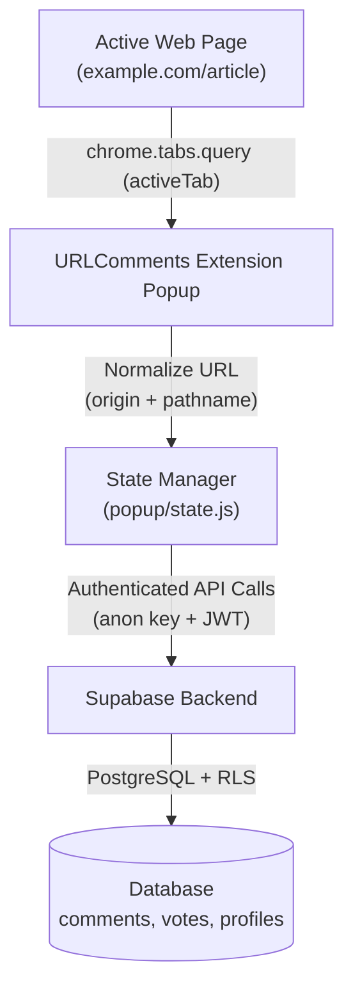

# 🏛️ URLComments Architecture & Technical Overview

🌍 [English](ARCHITECTURE.md) | [한국어](ko/ARCHITECTURE.md) | [日本語](ja/ARCHITECTURE.md) | [中文](zh/ARCHITECTURE.md) | [Español](es/ARCHITECTURE.md)

---

## 1. System Overview

URLComments connects Chrome browser users on any web URL without embedding intrusive third-party scripts into the host page or monitoring user navigation.



### Core Architectural Guarantees
1. **Zero-Invasive Browsing**: No content scripts inject UI into the visited page. The extension UI operates entirely within the isolated Chrome Extension popup or side panel.
2. **Explicit Interaction Trigger**: URL retrieval and comment queries occur **only** when the user opens the extension or explicitly clicks refresh.
3. **URL Normalization**: Strips `?query=...` and `#hash` fragments so that visitors to the same base document (`origin + pathname`) share a single discussion thread without exposing tracking tokens (e.g., UTM tags, session IDs).

---

## 2. Directory & Module Structure

The project uses Vanilla JavaScript (ES Modules) designed for high performance, zero framework overhead, and straightforward unit testing with Jest:

```
URLComments/
├── manifest.json              # Chrome Manifest V3 configuration
├── _locales/                  # Chrome i18n message catalogs (en, ko, ja, es, zh_CN, zh_TW)
├── assets/icons/              # Extension icons (16, 48, 128)
├── content/
│   └── spaDetector.js         # Lightweight URL change detector for SPAs (History & popstate)
├── lib/
│   ├── config.js              # Supabase project URL and anon public key
│   ├── supabaseClient.js      # Supabase JS SDK client singleton initialization
│   ├── publicId.js            # Deterministic canonical pseudonym generator
│   └── utils.js               # Pure utility helpers (URL normalization, string sanitize)
├── popup/
│   ├── popup.html             # Popup DOM structure & dialogs
│   ├── popup.css              # Responsive styling, dark/light themes, typography
│   ├── popup.js               # Entry point and bottom navigation routing
│   ├── state.js               # Centralized reactive state store
│   ├── api.js                 # Supabase query handlers (fetch, post, edit, delete, reply)
│   ├── comments.js            # Thread grouping, reply sorting, and pagination logic
│   ├── votes.js               # Like/Dislike reaction handlers and optimistic rollback
│   ├── my_comments.js         # User history view controller and pagination
│   ├── profile.js             # User identity, display name, and public ID binding
│   ├── settings.js            # User preferences (Theme, Font size, Language)
│   ├── render.js              # DOM builders for comment cards and replies
│   ├── i18n.js                # Dynamic locale switcher and runtime translation helper
│   └── ui.js                  # Modals, toasts, inline alerts, and view togglers
├── supabase/
│   └── migrations/            # Versioned SQL migration scripts (001 to 007)
└── docs/                      # Architecture, contributing, and database migration guides
```

---

## 3. Component Deep Dive

### 3.1 State Management (`popup/state.js`)
State is centralized to maintain a single source of truth:
- `normalizedCurrentUrl`: The sanitized URL for the active tab.
- `currentComments`: In-memory list of comments fetched for the current URL.
- `currentUser`: The Supabase Auth user session.
- `currentPage`: Current page index for thread pagination.
- `activeFilter`: Current navigation tab (`home`, `my-comments`, `settings`).

### 3.2 Threading & 1-Depth Hierarchy (`popup/comments.js`)
- **Grouping (`groupCommentThreads`)**: Partitions active/soft-deleted comments into parent threads and associated sibling replies based on `parent_id`.
- **Chronological Sorting (`compareCommentsChronological`)**: Orders both top-level parents and child replies strictly oldest-first (`created_at ASC`), using bigint-safe ID comparison as a secondary deterministic sort key.
- **Thread Pagination (`paginateThreads`)**: Paginates top-level threads (`THREADS_PER_PAGE = 10`) without breaking a parent comment away from its replies.

### 3.3 Public Identity (`lib/publicId.js`)
To protect user email addresses and OAuth identifiers:
- Generates a friendly, deterministic canonical pseudonym format:
  `@adjective-noun-preposition-place-XXXXX`
- Backed by the `public.profiles` table with custom user-editable `display_name`.

### 3.4 Reactions & Voting (`popup/votes.js`)
- 1 user = 1 vote per comment (like or dislike).
- Employs **optimistic UI updates** with instant count adjustment and automatic rollback if the Supabase RPC/REST request fails.
- Reaction buttons are placed directly beside the author header in a compact, accessible inline group.

---

## 4. Security & Privacy Model

| Area | Security Measure |
| :--- | :--- |
| **Authentication** | Supabase Auth with Google OAuth via `chrome.identity.launchWebAuthFlow`. Tokens stored in `chrome.storage.local`. |
| **Row Level Security** | All tables (`comments`, `profiles`, `comment_votes`, `reported_comments`) are protected with strict RLS policies. |
| **Client Privileges** | Only the public `anon` API key is bundled into `lib/config.js`. The `service_role` key is strictly forbidden. |
| **Sanitization** | User inputs are limited to 1,000 characters and rendered via `textContent` or controlled DOM nodes to prevent XSS. |
| **Soft Delete** | Deleting a parent comment sets `is_deleted = true`, preserving reply context while erasing the author name and comment body. |
