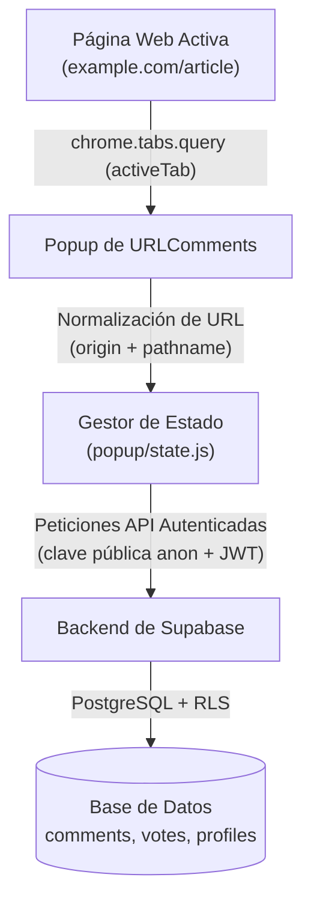

# 🏛️ Arquitectura y Descripción Técnica de URLComments

🌍 [English](../ARCHITECTURE.md) | [한국어](../ko/ARCHITECTURE.md) | [日本語](../ja/ARCHITECTURE.md) | [中文](../zh/ARCHITECTURE.md) | [Español](ARCHITECTURE.md)

Este documento detalla la arquitectura técnica, la estructura modular y los principios de ingeniería de la extensión para Chrome **URLComments**.

---

## 1. Visión General del Sistema

URLComments conecta a los usuarios en cualquier URL web sin inyectar código invasivo en la página anfitriona ni rastrear el historial de navegación.



### Garantías Principales
1. **Navegación No Invasiva**: No se inyecta UI ni scripts en el DOM de la página visitada; todo ocurre dentro del popup o side panel aislado de Chrome.
2. **Activación Exclusiva por el Usuario**: La URL activa y los comentarios solo se solicitan cuando el usuario abre la extensión o pulsa refrescar (`↻`).
3. **Normalización Estricta de URL**: Se eliminan parámetros de búsqueda (`?query=...`) y fragmentos (`#hash`), garantizando un único espacio de comentarios para la ruta base sin filtrar identificadores personales o UTMs.

---

## 2. Estructura Modular

Construido íntegramente con JavaScript estándar (Vanilla JS con ES Modules) para garantizar velocidad máxima y cero sobrecarga de frameworks:

```
URLComments/
├── manifest.json              # Configuración Manifest V3
├── _locales/                  # Catálogos de idioma (en, ko, ja, es, zh_CN, zh_TW)
├── popup/
│   ├── state.js               # Almacén de estado reactivo centralizado
│   ├── api.js                 # Manejadores de consultas a Supabase
│   ├── comments.js            # Agrupación de hilos, ordenación y paginación
│   ├── votes.js               # Votaciones Me gusta / No me gusta con UI optimista
│   ├── my_comments.js         # Historial de comentarios del usuario
│   ├── profile.js             # Identidad pública y gestión del nombre visible
│   ├── settings.js            # Tema, tamaño de fuente e idioma
│   ├── render.js              # Constructores DOM
│   └── i18n.js                # Cambio dinámico de idioma
└── docs/                      # Guías y documentación técnica
```

---

## 3. Componentes Fundamentales

### 3.1 Paginación y Jerarquía de 1 Nivel (`popup/comments.js`)
- **Agrupación (`groupCommentThreads`)**: Asocia comentarios padre con todas sus respuestas hermanas mediante `parent_id`.
- **Orden Cronológico Estricto (`compareCommentsChronological`)**: Los padres y las respuestas se ordenan siempre de más antiguo a más reciente (`created_at ASC`).
- **Paginación por Hilo (`paginateThreads`)**: Pagina unidades completas de hilos principales (10 por página), impidiendo que un padre y sus respuestas queden separados en páginas distintas.
