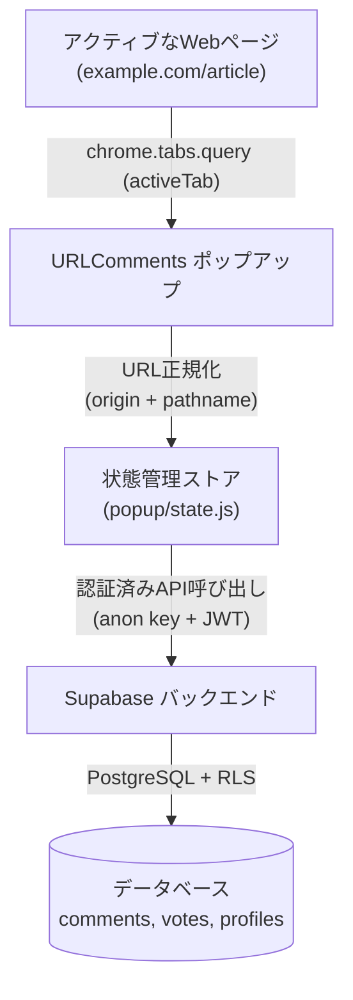

# 🏛️ URLComments アーキテクチャと技術概要

🌍 [English](../ARCHITECTURE.md) | [한국어](../ko/ARCHITECTURE.md) | [日本語](ARCHITECTURE.md) | [中文](../zh/ARCHITECTURE.md) | [Español](../es/ARCHITECTURE.md)

このドキュメントでは、URLComments Chrome拡張機能のシステム設計、モジュール構造、および中核となる設計思想について説明します。

---

## 1. システム概要

URLCommentsは、閲覧中のWebページに外部スクリプトを埋め込んだりユーザーの閲覧履歴を追跡したりすることなく、正規化されたURLをキーとしたパブリックなディスカッション空間を提供します。



### アーキテクチャの中核保証
1. **非侵入型のブラウジング**: Webページ内にDOMやスクリプトを一切挿入しません。すべてのUIは分離されたChrome拡張ポップアップ/サイドパネル内で完結します。
2. **明示的なユーザーアクションでのみ実行**: ポップアップを開くか、手動で更新ボタン（`↻`）を押したときにのみ、現在のアクティブタブのURLを読み取りコメントを取得します。
3. **厳格なURL正規化**: クエリ文字列（`?utm=...`）やハッシュフラグメント（`#hash`）を除去し、ベースとなる文書パス（`origin + pathname`）でコメントを共有し、個人のトラッキングトークン漏洩を防ぎます。

---

## 2. ディレクトリおよびモジュール構成

フレームワークのオーバーヘッドを排除し、軽量・高速な実行を維持するため、純粋なVanilla JS（ES Modules）を採用しています：

```
URLComments/
├── manifest.json              # Chrome Manifest V3 設定
├── _locales/                  # 多言語メッセージカタログ (en, ko, ja, es, zh_CN, zh_TW)
├── popup/
│   ├── state.js               # 集中管理リアクティブ状態ストア
│   ├── api.js                 # Supabase データ通信ハンドラー
│   ├── comments.js            # スレッドグループ化、返信ソート、ページネーション
│   ├── votes.js               # いいね/ひどいね リアクションと楽観的UI
│   ├── my_comments.js         # コメント履歴とタブ管理
│   ├── profile.js             # 公開IDと表示名管理
│   ├── settings.js            # テーマ、フォントサイズ、言語設定
│   ├── render.js              # DOM レンダリング
│   └── i18n.js                # 動的言語切り替え
└── docs/                      # 各種技術ドキュメント
```

---

## 3. 主要コンポーネント詳細

### 3.1 状態管理 (`popup/state.js`)
- `normalizedCurrentUrl`: 現在のアクティブタブの正規化URL。
- `currentComments`: 現在のURLで取得されたインメモリコメント一覧。
- `currentUser`: Supabase Auth のセッション情報。
- `currentPage`: スレッドページネーションの現在ページ番号。

### 3.2 1階層スレッド構造 (`popup/comments.js`)
- **グループ化 (`groupCommentThreads`)**: `parent_id`に基づいて親コメントと複数の兄弟返信をまとめます。
- **時系列ソート (`compareCommentsChronological`)**: 親スレッドおよび返信ともに作成日時の昇順（`created_at ASC`）で表示され、BigInt-safeなID比較がセカンダリキーとして機能します。
- **スレッド単位ページネーション (`paginateThreads`)**: 1ページあたり10スレッド単位で分割し、親と返信が別ページに分断されないようにします。

### 3.3 公開識別子 (Public ID - `lib/publicId.js`)
メールアドレスやOAuth IDを秘匿するため、決定論的な識別子を生成します：
`@adjective-noun-preposition-place-XXXXX`
ユーザーは表示名（Display Name）を自由に変更できます。
