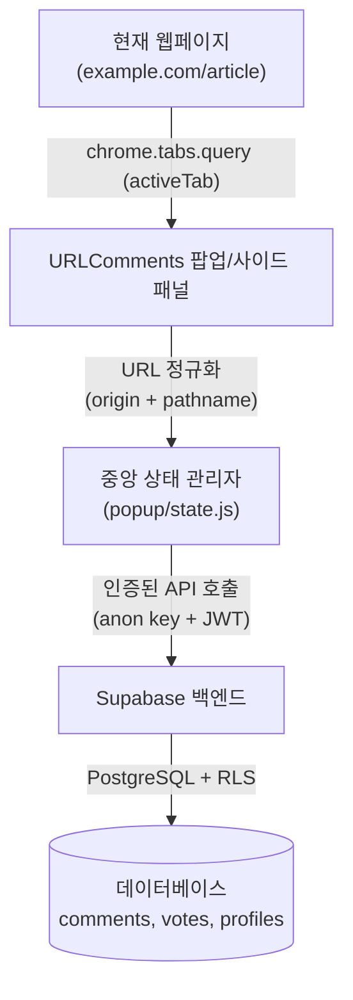

# 🏛️ URLComments 아키텍처 및 기술 개요

🌍 [English](../ARCHITECTURE.md) | [한국어](ARCHITECTURE.md) | [日本語](../ja/ARCHITECTURE.md) | [中文](../zh/ARCHITECTURE.md) | [Español](../es/ARCHITECTURE.md)

본 문서는 URLComments Chrome 확장 프로그램의 시스템 아키텍처, 모듈 구조, 핵심 엔지니어링 원칙을 설명합니다.

---

## 1. 시스템 개요

URLComments는 방문 중인 웹페이지에 스크립트를 무단 삽입하거나 사용자의 탐색 기록을 추적하지 않고, 열려 있는 정규화 URL 기반의 공개 소통 공간을 제공합니다.



### 핵심 아키텍처 보장 사항
1. **비침해 브라우징**: 방문 중인 웹페이지 내부에 DOM이나 스크립트를 주입하지 않습니다. 모든 UI는 샌드박스화된 Chrome 확장 팝업/사이드 패널 내에서 동작합니다.
2. **명시적 요청 트리거**: 팝업을 열거나 명시적으로 새로고침(`↻`) 버튼을 누를 때만 현재 활성 탭의 URL을 확인하고 댓글을 조회합니다.
3. **엄격한 URL 정규화**: 쿼리스트링(`?utm=...`)과 해시(`#hash`)를 제거하여, 동일 기본 경로(`origin + pathname`)의 방문자가 동일한 소통 공간을 공유하도록 하며 개인 식별 토큰 유출을 원천 방지합니다.

---

## 2. 디렉토리 및 모듈 구조

프레임워크 오버헤드를 배제하고 고성능과 가벼운 번들 크기를 유지하기 위해 순수 Vanilla JS (ES Modules)로 구현되었습니다:

```
URLComments/
├── manifest.json              # Chrome Manifest V3 설정 파일
├── _locales/                  # Chrome 다국어 번역 카탈로그 (en, ko, ja, es, zh_CN, zh_TW)
├── assets/icons/              # 확장 프로그램 아이콘 (16, 48, 128)
├── content/
│   └── spaDetector.js         # SPA 페이지 이동 감지기 (History & popstate)
├── lib/
│   ├── config.js              # Supabase 접속 정보 (URL, anon key)
│   ├── supabaseClient.js      # Supabase JS SDK 싱글톤 초기화
│   ├── publicId.js            # 결정론적 고유 Public ID 생성기
│   └── utils.js               # 순수 헬퍼 (URL 정규화, 문자열 이스케이프)
├── popup/
│   ├── popup.html             # 팝업 DOM 레이아웃 및 모달
│   ├── popup.css              # 반응형 스타일, 다크/라이트 테마, 타이포그래피
│   ├── popup.js               # 진입점 및 하단 탭 내비게이션 라우팅
│   ├── state.js               # 중앙 집중식 반응형 상태 저장소
│   ├── api.js                 # Supabase 데이터 요청 핸들러 (조회, 등록, 수정, 삭제, 답글)
│   ├── comments.js            # 스레드 그룹핑, 대댓글 정렬 및 페이지네이션
│   ├── votes.js               # 좋아요/싫어요 반응 및 낙관적 UI 롤백
│   ├── my_comments.js         # 내 댓글 이력 조회 및 필터링
│   ├── profile.js             # 사용자 정체성 및 닉네임 관리
│   ├── settings.js            # 사용자 환경설정 (테마, 글자 크기, UI 언어)
│   ├── render.js              # 댓글 카드 및 대댓글 DOM 렌더러
│   ├── i18n.js                # 동적 언어 전환 및 런타임 번역 헬퍼
│   └── ui.js                  # 모달, 토스트, 알림 배너 제어
├── supabase/
│   └── migrations/            # 버전 관리된 SQL 마이그레이션 (001 ~ 007)
└── docs/                      # 아키텍처, 기여 가이드 및 DB 운영 문서
```

---

## 3. 핵심 컴포넌트 상세

### 3.1 상태 관리 (`popup/state.js`)
- `normalizedCurrentUrl`: 현재 활성 탭의 정규화된 URL.
- `currentComments`: 현재 URL에서 조회된 인메모리 댓글 원본 목록.
- `currentUser`: Supabase Auth 세션 정보.
- `currentPage`: 스레드 페이지네이션의 현재 페이지 번호.
- `activeFilter`: 현재 활성 네비게이션 탭 (`home`, `my-comments`, `settings`).

### 3.2 스레드 계층 구조 & 1단계 대댓글 (`popup/comments.js`)
- **스레드 그룹핑 (`groupCommentThreads`)**: `parent_id`를 기준으로 최상위 부모 댓글과 이에 속한 자식 대댓글들을 그룹화합니다.
- **시간순 정렬 (`compareCommentsChronological`)**: 부모 스레드와 자식 대댓글 모두 작성일시 오름차순(`created_at ASC`)으로 엄격하게 정렬되며, BigInt-safe ID 비교를 보조 정렬 키로 사용합니다.
- **스레드 단위 페이지네이션 (`paginateThreads`)**: 페이지당 10개 스레드 단위로 페이지를 나누며, 부모 댓글과 대댓글이 다른 페이지로 쪼개지지 않도록 보장합니다.

### 3.3 공개 식별자 (Public Identity - `lib/publicId.js`)
이메일과 OAuth 고유 식별자를 노출하지 않기 위해 다음 형식의 고유 가명을 생성합니다:
`@adjective-noun-preposition-place-XXXXX`
사용자는 `public.profiles` 테이블을 통해 표시 이름(Display Name)을 자유롭게 변경할 수 있습니다.

### 3.4 반응 및 투표 시스템 (`popup/votes.js`)
- 1인 1댓글 1표 원칙 (좋아요 또는 싫어요).
- **낙관적 UI 업데이트(Optimistic UI)**: 클릭 즉시 카운트를 반영하고, Supabase 요청 실패 시 원래 상태로 롤백합니다.
- 작성자 닉네임 바로 옆에 인라인으로 작고 컴팩트하게 배치됩니다.
