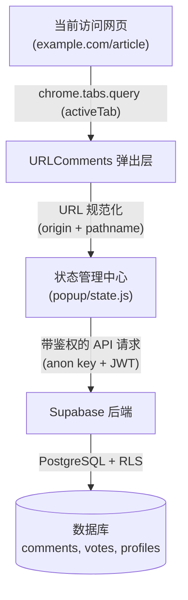

# 🏛️ URLComments 系统架构与技术概览

🌍 [English](../ARCHITECTURE.md) | [한국어](../ko/ARCHITECTURE.md) | [日本語](../ja/ARCHITECTURE.md) | [中文](ARCHITECTURE.md) | [Español](../es/ARCHITECTURE.md)

本文档阐述 URLComments Chrome 扩展程序的技术架构、模块划分和核心设计原则。

---

## 1. 系统概览

URLComments 在不向用户正在访问的网页中注入任何入侵式脚本或追踪用户浏览记录的前提下，基于规范化后的 URL 提供公共交流空间。



### 核心设计原则
1. **非侵入式浏览**: 不在目标网页 DOM 中注入任何 UI 或脚本，所有界面均运行在独立的 Chrome 扩展弹出层/侧边栏中。
2. **显式用户触发**: 仅在用户主动打开扩展或手动点击刷新（`↻`）时，才读取当前标签页的 URL 并拉取评论。
3. **严格的 URL 规范化**: 自动剔除查询参数（`?utm=...`）和哈希锚点（`#hash`），在保护个人隐私与追踪标记的同时共享交流空间。

---

## 2. 模块结构

为杜绝打包体积膨胀并保持高性能，项目采用纯原生 Vanilla JS（ES Modules）构建：

```
URLComments/
├── manifest.json              # Chrome Manifest V3 配置
├── _locales/                  # 多语言消息目录 (en, ko, ja, es, zh_CN, zh_TW)
├── popup/
│   ├── state.js               # 集中式响应式状态管理
│   ├── api.js                 # Supabase 数据请求处理
│   ├── comments.js            # 评论树分组、回复排序与分页
│   ├── votes.js               # 赞/踩反应及乐观 UI 回滚
│   ├── my_comments.js         # 我的评论历史记录
│   ├── profile.js             # 公开标识与显示名称管理
│   ├── settings.js            # 主题、字体及语言设置
│   ├── render.js              # DOM 构建
│   └── i18n.js                # 动态语言切换
└── docs/                      # 架构及使用文档
```

---

## 3. 核心机制

### 3.1 严格的时间正序与 1 层回复 (`popup/comments.js`)
- **线程分组 (`groupCommentThreads`)**: 根据 `parent_id` 将顶层主评论与子回复归类在一起。
- **时间递增排序 (`compareCommentsChronological`)**: 主评论与子回复均严格按照创建时间升序（`created_at ASC`）排列，并使用 BigInt 安全的 ID 进行辅助排序。
- **线程分页 (`paginateThreads`)**: 按顶层评论线程单位分页（每页 10 个主线程），父评论及其所有回复永远保存在同一页中。
